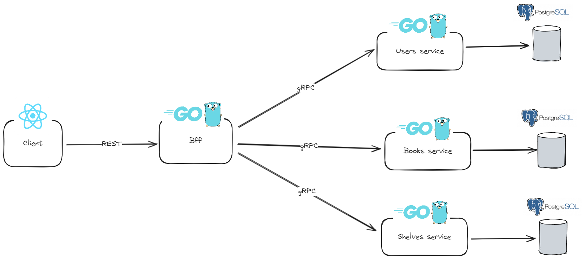

# Shirabe 
**Shirabe** is a comprehensive digital platform designed for book enthusiasts to organize, manage, and track their reading journey. It allows users to create personalized virtual shelves, categorize their book collections, and monitor their reading progress seamlessly.

## Architecture 

  

## Functionnal services 
The app is decomposed into two core microservices. There are independently deployable applications organizaed around a certain business domains. There are [gRPC]() services.  

 
gRPC (gRPC Remote Procedure Calls) is an open-source, high-performance, remote procedure call (RPC) framework developed by Google. It enables communication between client and server applications in a distributed system, using HTTP/2 for transport, Protocol Buffers (Protobuf) as the interface description language, etc.

### Books service 

| Method    | Request Type         | Response Type        | Description                         |
|-----------|----------------------|----------------------|-------------------------------------|
| GetBook   | `GetBookRequest`     | `GetBookResponse`    | Retrieve details of a specific book |
| GetBooks | `GetBooksRequest`   | `GetBooksResponse`  | Retrieve a list of all books        |
| CreateBook   | `CreateBookRequest`     | `CreateBookResponse`    | Add a new book to the collection    |
| UpdateBook   | `UpdateBookRequest`     | `UpdateBookResponse`    | Update book information (reading progress)   |
| SearchBooks   | `SearchBooksRequest`     | `SearchBooksResponse`    | Search books based on title, author or status    |
| GetBooksByIds  | `GetBooksByIdsRequest`     | `GetBooksByIdsResponse`    | Get books by passing an array of ids    |
| CreateReadingProgress  | `CreateReadingProgressRequest`     | `ReadingProgress`    | Create a reading progress for a given book    |
| GetReadingProgress  | `GetReadingProgressRequest`     | `ReadingProgresses`    | Track the reading progress for a specific book  |

To learn more about the request and response type check the [service's README](/books/). 

### Shelves service

| Method    | Request Type         | Response Type        | Description                         |
|-----------|----------------------|----------------------|-------------------------------------|
| GetShelves   | `GetShelvesRequest`     | `GetShelvesResponse`    | Retrieve a list of all shelves  |
| CreateShelf | `CreateShelfRequest`   | `CreateShelfResponse`  | Create a new shelf        |
| UpdateShelf   | `UpdateShelfRequest`     | `UpdateShelfResponse`    | Update shelf information    |
| RemoveShelf   | `RemoveShelfRequest`     | `RemoveShelfResponse`    | Remove a shelf    |
| GetShelf   | `GetShelfRequest`     | `GetShelfResponse`    | Retrieve details of a specific shelf    |

To learn more about the request and response type check the [service's README](/shelves/). 

## Backend for frontend

The [Backend for Frontend (BFF)](https://learn.microsoft.com/en-us/azure/architecture/patterns/backends-for-frontends) pattern is an architectural design that involves creating a dedicated backend service tailored specifically for a single frontend application or client. This pattern aims to streamline and optimize the interaction between the frontend and backend systems by providing a customized API that addresses the unique needs of a particular client interface.

In this project, the bff is responsible for fetching data from the grpc services, aggregating them, and exposing a REST API consumed by the web app.

Here is the endpoints list: 

| Method          | Path                    | Description      | 
|-----------------|----------------------   |----------------------|
| GET      | /books   | Get All books for the current user    |
| GET     | /books/{bookId}   | Get details of a specific book. |
| POST     | /books  | Add a new book to the library.  |
| PUT       | /books/{bookId}    | Update details of a specific book.  |
| DELETE        | /books/{bookId}      | Delete a specific book from the library.   |
| GET        | /books/search     | Search for books by title, author, or keywords.   |
| GET      | /shelves   | Get all shelves for the current user.   |
| GET     | /shelves/{shelfId}   | Get details of a specific shelf. |
| POST     | /shelves  | Create a new shelf.   |
| PUT       | /shelvess/{shelfId}    | Update details of a specific shelf.   |
| DELETE        | /shelves/{shelfId}      | Delete a specific shelf.  |
| GET        | /shelves/{shelfId}/books   | Get all books on a specific shelf.   |
| POST        | /shelves/{shelfId}/books/{bookId}     | Add a book to a shelf.    |
| DELETE        | /shelves/{shelfId}/books/{bookId}      | Remove a book from a shelf.    |
| POST        | /users  | Remove a book from a shelf.    |
| POST        | /auth/login  | Authenticate a user and generate an authentication token.    |
| POST        | /auth/logout  | Invalidate the authentication token.    |

## Web

## Installation
### Before you start 
- Install Docker and Docker Compose.

## License 
The tool is available as open source under the terms of the [MIT License](https://opensource.org/license/MIT)

## Built by

- Marius Vincent NIEMET [Twitter](https://twitter.com/mariusniemet05) [LinkedIn](https://www.linkedin.com/in/marius-vincent-niemet-928b48182/) 

